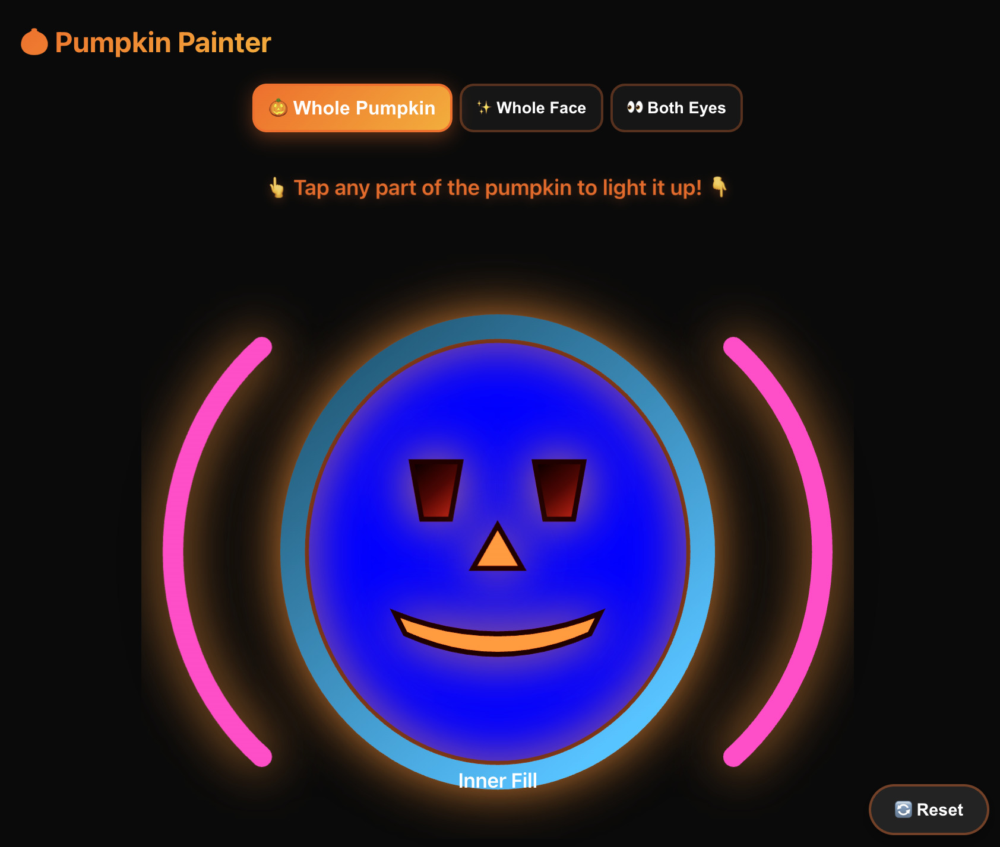
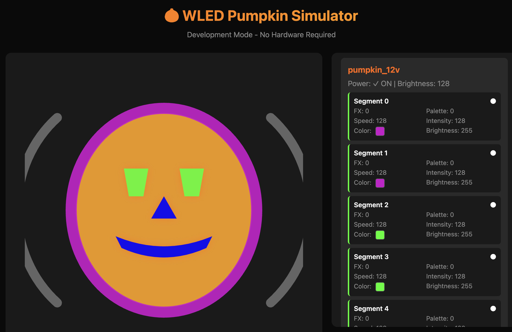

# 🎃 Pumpkin Painter


A web app for controlling a Halloween pumpkin LED installation using WLED controllers. Features a visual pumpkin interface, a hardware simulator, and an admin panel. The pumpkin installation is colloquially and lovingly nicknamed 'Jackie'.

This installation was featured at [Night Bazaar Spook](https://www.folkways.org/schedule/night-bazaar-spook) in November 2025 in partnership with [LesleyDidThat](https://www.lesleydidthat.com/) and Folkways. Fargo, ND.

## About this project

This project started simple enough. We had pixel and bullet LEDs and wanted to hang them on a grid wall in the shape of a pumpkin as a fun background installation. The idea for interactivity came a few days before the event and I wanted to push myself to see what is possible when someone who understands the architecture of a simple system uses an advanced LLM to build out a user interface using only english language. It all started in [DESIGN.md](./docs/DESIGN.md) - with 20 minutes of writing and a half hour of conversation with the LLM, we had a prototype up and running.

This project was deployed using 2 DigOcta WLED controllers, 2750 LEDs (2000 12v @ 200 watts, 750 24v bullet pixels @ 225 watts), an offline wifi network running on an old Airport Extreme base station, a raspberry pi running this software, and an iPad (for viewing the html page on the local network).

This project wasn't originally going to be interactive, but I had this idea where I wanted kids to be able to "paint" the pumpkin on the wall using a constrainted set of effects and color pallettes that I selected to work well together. As a bonus, this project also includes a hardware simulator, a screensaver, an accurate pumpkin representation written in SVG (whoa), and an idle mode that is way cooler than it has any right to be (the idle effects are managed entirely from background javascript on the ipad when user interactivity is not detected after a period of time).

The hardware config is managed by hand but the entire project was co-written with an LLM using Cursor Pro as an experiment to see what's possible with the state of agentic AI coding circa Nov. 2026. The installation ran for 6 hours on a single evening and worked flawlessly. 

I did not write a single line of code for this project by hand. This was the first project I've done where I was genuinely blown away at the level of sophistication the LLM showed at bug fixing, identifying issues from my screenshots alone, refactoring, and generally being wildly efficient at implementing under my directive.

## Gallery


<div align="center">

<!--  -->


</div>

### Web Interface

<div align="center">






</div>

## Features

- **Visual Pumpkin Interface** - Tap on different parts of the pumpkin to control them
- **WLED Effects & Palettes** - Choose from various effects and color palettes
- **Hardware Simulator** - Test without physical hardware
- **Admin Panel** - Advanced control for individual segments

## Quick Start

### Installation

```bash
npm install
```

### Configuration

Edit `config/pumpkin.json` with your WLED controller IP addresses:

```json
{
  "controllers": {
    "pumpkin_12v": {
      "ip": "192.168.1.100",
      "name": "12v Controller",
      "segments": 8
    }
  }
}
```

### Run

```bash
# With hardware
npm start

# With simulator (no hardware needed)
npm run start:sim
```

Open http://localhost:3000 in your browser.

## Usage

### Main Interface (`/`)

Tap on parts of the pumpkin (eyes, nose, mouth, shell, etc.) to select effects and palettes. Changes apply instantly.

### Admin Panel (`/admin.html`)

Advanced interface for controlling individual segments, power, brightness, and viewing controller status.

## Development

```bash
# Development mode with auto-reload
npm run dev

# With simulator
npm run dev:sim
```

## License

MIT License
